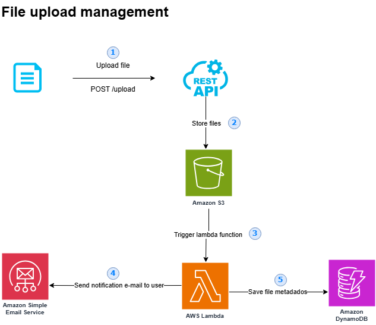
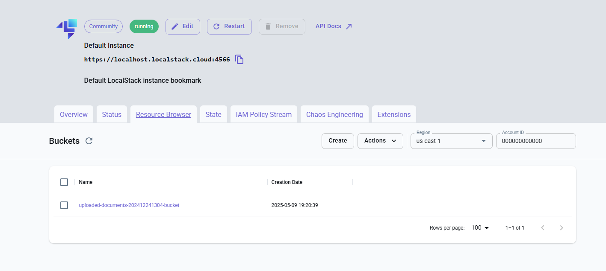
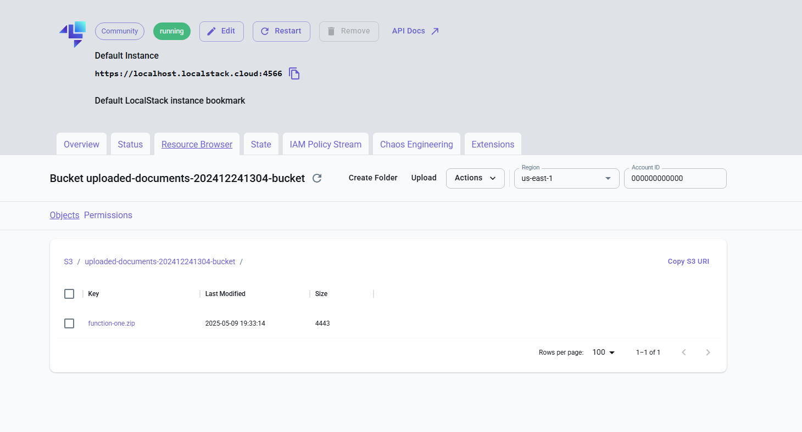
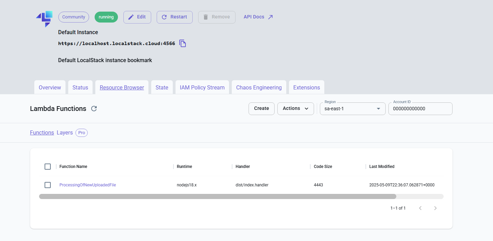
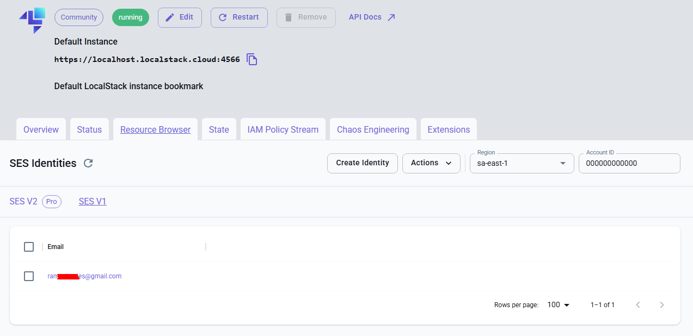
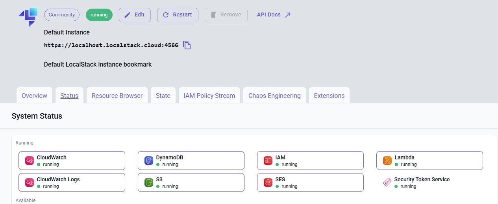
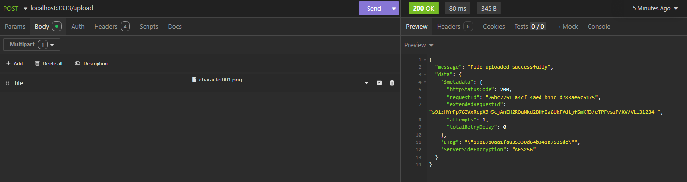
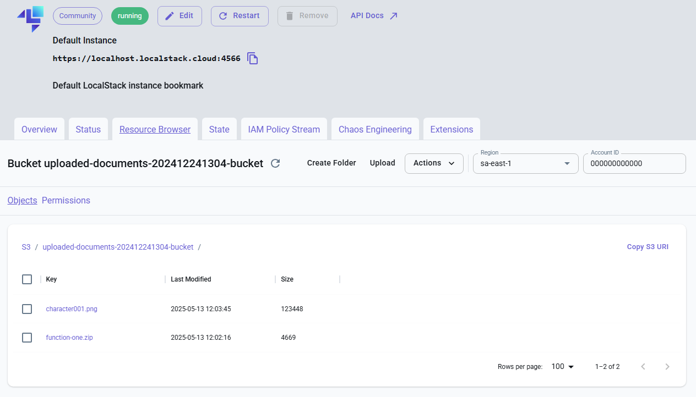
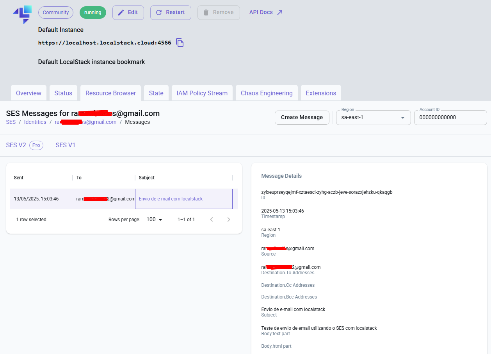

<div style="text-align: center; scale: 0.7;">
    
</div>

# AWS-SDK-Explorer
This repository is a personal project designed to explore and study the main tools of the AWS SDK (Software Development Kit). It implements a basic yet functional document backup and notification system using a variety of AWS services, providing a practical learning environment for interacting with the AWS cloud.

## Motivation and Features
The primary goal of this repository is to gain hands-on experience with the some AWS services (S3, Lambda, SES, CloudWatch, DynamoDB and SNS). Read more about the motivation behind this project in the [Motivation and features](docs/motivation.md) document. Follow the diagram below to understand the architecture of the project:

<div style="text-align: center;">
    
</div>

## Getting Started
To start using this project, it is necessary to set up some prerequisites. The following steps will guide you through the setup process.

### Initializing localstack
To initialize the localstack environment, run the following command:

```bash
export DOCKER_SOCK=/var/run/docker.sock
localstack start
```
The dashboard can be accessed at [https://app.localstack.cloud/dashboard](https://app.localstack.cloud/dashboard).

## Creating S3 Bucket
To create an S3 bucket, run the following command:

```bash
aws s3 mb s3://uploaded-documents-202412241304-bucket --endpoint-url=http://localhost:4566
```

Bucket name: `uploaded-documents-202412241304-bucket`



## Creating IAM Role
IAM is a service that helps you manage access to AWS services and resources securely. To create an IAM role, run the following command:

```bash
aws --endpoint-url=http://localhost:4566 iam create-role --role-name lambda-ex --assume-role-policy-document file://<(echo '{ "Version": "2012-10-17", "Statement": [ { "Effect": "Allow", "Principal": { "Service": "lambda.amazonaws.com" }, "Action": "sts:AssumeRole" } ] }')
```

The role name is `lambda-ex` and the policy document is defined in the command.

## Uploading a Zipped Function to an AWS Bucket
Before uploading a zipped function, ensure that you have zipped your Lambda function code. Ensure that you will exececute the following command in the root folder of your project (in this case, the `aws-sdk-explorer` folder):

```bash
npm run zip
```

To upload a zipped function to an AWS S3 bucket, use the following command:

```bash
npm run upload-aws
```

Replace `function-one.zip` with the name of your zipped function file. This command uploads the file to the specified S3 bucket. This is a crucial step in deploying your Lambda function, as it allows AWS to access the code that will be executed.



## Creating Lambda Function
With your zipped function uploaded to S3, you can create a Lambda function using the following command:

```bash
aws --endpoint-url="http://localhost:4566" lambda create-function --function-name ProcessingOfNewUploadedFile --runtime nodejs18.x --role arn:aws:iam::000000000000:role/lambda-ex --handler dist/index.handler \
--code S3Bucket=uploaded-documents-202412241304-bucket,S3Key=function-one.zip
```
Replace `ProcessingOfNewUploadedFile` with the name of your Lambda function, and ensure that the `S3Bucket` and `S3Key` parameters match the bucket and file you uploaded earlier.



## Creating Lambda Trigger
Triggers are used to invoke your Lambda function in response to events. Always that we send a file to the S3 bucket, we want to trigger the Lambda function. To create a trigger, use the following command:

```bash
aws --endpoint-url="http://localhost:4566" s3api put-bucket-notification-configuration --bucket uploaded-documents-202412241304-bucket --notification-configuration '{
        "LambdaFunctionConfigurations": [
            {
                "Id": "MeuTriggerS3",
                "LambdaFunctionArn": "arn:aws:lambda:sa-east-1:000000000000:function:ProcessingOfNewUploadedFile",
                "Events": ["s3:ObjectCreated:*"]
            }
        ]
    }' --skip-destination-validation
```

`s3api` is used to configure the S3 bucket notification. In this case, we are using the `put-bucket-notification-configuration` command to set up a notification configuration for the S3 bucket. The `LambdaFunctionConfigurations` parameter specifies the Lambda function that will be triggered when an object is created in the S3 bucket.

The `--skip-destination-validation` does exactly this: it does not send the test call to the Lambda and allows the configuration to be applied even if the "official" permission test fails.

## Verifying e-mail identity to SES service
SES (Simple Email Service) is a cloud-based email sending service. Before you can send emails using SES, you need to verify your email identity, that usually will be the from address of the email. So, let's use `VerifyEmailIdentity` command to add the email identity to SES:

```bash
aws --endpoint-url=http://localhost:4566 ses verify-email-identity --email-address ramonbsales@gmail.com
```

Obs: In the localstack environment, the identity verification does not require aditional steps, such as DNS configuration or email confirmation. The email address is automatically verified.



## Creating DynamoDB Table
DynamoDB is a fully managed NoSQL database service. To create a DynamoDB table, use the following command:

```bash
aws --endpoint-url=http://localhost:4566 dynamodb create-table \
--table-name MetadadosBackup \
--key-schema AttributeName=IDdoArquivo,KeyType=HASH AttributeName=DataDoUpload,KeyType=RANGE \
--attribute-definitions AttributeName=IDdoArquivo,AttributeType=S AttributeName=DataDoUpload,AttributeType=S \
--billing-mode PAY_PER_REQUEST
```

For example, if you want add a new record to the table, you can use the following command:

```bash
aws --endpoint-url=http://localhost:4566 dynamodb put-item --table-name MetadadosBackup --item '{"IDdoArquivo": {"S": "1234567890"}, "DataDoUpload": {"S": "2023-12-28T10:00:00Z"}, "NomeDoArquivo": {"S": "documento_importante.docx"}}'
```

In this example, we are adding a new item to the `MetadadosBackup` table with the specified attributes, such as `IDdoArquivo`, `DataDoUpload`, and `NomeDoArquivo`. The `put-item` command is used to add or replace an item in the table. `S` indicates that the attribute is a string.

Now, you can check in the localstack dashboard, each aws service has been used throughout the project.


## Uploading a file using Node.js API
This repository provides a Node.js API to upload files to the S3 bucket. To run the API, use the following command:

```bash
npm run dev
```

Now, you can use a tool like Postman/Insomnia or cURL to send a POST request to the API endpoint. The API will handle the file upload to the S3 bucket. In this example, we are configuring body form-data with the key `file` and the value as the file you want to upload.



The endpoint URL is `http://localhost:3000/upload`, and the request method is `POST`.

If the upload is successful, you will see file into the `S3` bucket:


`Lambda function` will be triggered, and the file will be processed. The metadata will be stored in the `DynamoDB` table: 


And an email notification will be sent using `SES`:


If you want to see the logs of the Lambda function, you can acces `CloudWatch` logs in the localstack dashboard. The logs will show the details of the Lambda function execution, including any errors or messages generated during the process.

`CloudWatch` logs are a powerful tool for monitoring and troubleshooting your AWS resources. In this case, you can view the logs generated by the Lambda function to understand its behavior and performance.


## Conclusion
This project serves as a foundation for a robust and practical understanding of the AWS SDK and its diverse set of tools. By implementing a real-world use case, this repository aims to bridge the gap between theoretical knowledge and practical application in the AWS cloud environment.

To know more about future enhancements and potential features, check out the [Future Enhancements](docs/future-enhancements.md) document.